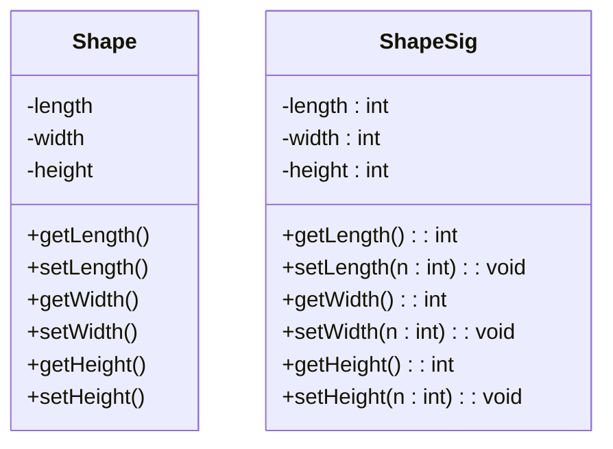
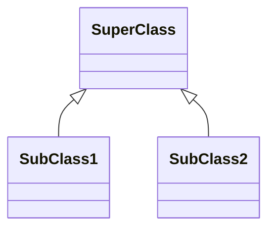

#sample UML diagram for CSC102 class by Zolton Akocs 
#ethakocs@uat.edu

Create a diagram with 2 classes, thoes classes need 3 atributes, 3 methods

Attributes come before properties or methods 
\+ public, \- private, \# protected  

